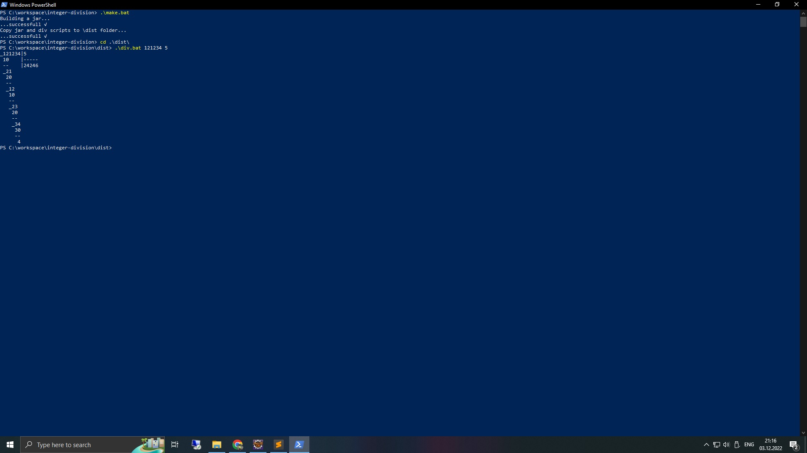
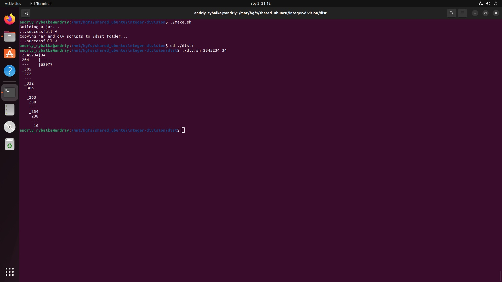
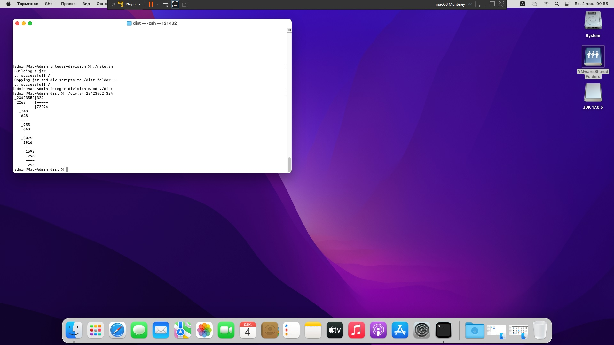

# Task 4 (Integer Division, OOP, algoritmization)

## Basic task
Write an application that divides numbers and prints result into console. + JUnit tests(!!!).

Example of result:
```bash
_78945│4
 4    |-----
 -    |19736
_38
 36
 --
 _29
  28
  --
  _14
   12
   --
   _25
    24
    --
     1
```

## Screenshots







## Java version
**17.0.5**


## JDK download
Windows x64: [here](https://www.oracle.com/cis/java/technologies/downloads/#jdk17-windows)

Linux x64: [here](https://www.oracle.com/cis/java/technologies/downloads/#jdk17-linux)

MacOS: [here](https://www.oracle.com/cis/java/technologies/downloads/#jdk17-mac)


## How to run
**Making a jar:**

*Windows*
```bash
$\integer-division> .\make.bat
```

*Linux or MacOS*
```bash
$\integer-division> ./make.sh
```


**Running:**
*Windows*
```bash
$\integer-division> \dist\div.bat 123456 789
```

*Linux or MacOS*
```bash
$\integer-division> /dist/div.sh 123456 789
```